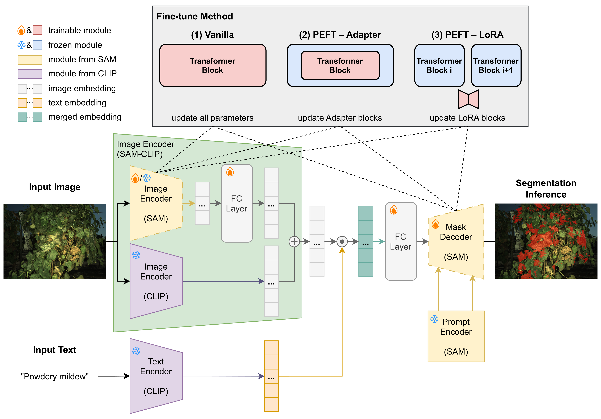

# SAM-CLIP
**Authors**: [Yiyuan Lin](https://yiyuanlinxx.github.io/), Zachary Dashner, Ana Jimenez, Dustin Wilkerson, Lance Cadle-Davidson, Summaira Riaz, [Yu Jiang](https://cals.cornell.edu/people/yu-jiang)

[[**`Paper`**]()] [[**`Dataset`**](https://cornell.app.box.com/folder/359649298815?s=qkofzu5b24hqkev6y9raga9t9ihoc5l1)] [[**`BibTex`**](#Citation)]

---

This is the official implementation of **SAM-CLIP** proposed in our paper [Integrating Large Multi-Modal Models for Automated Powdery Mildew Phenotyping in Grapevines](), a large multi-modal model where Segment Anything Model (SAM) extended with Contrastive Language-Image Pretraining (CLIP) embeddings for improved segmentation performance. It enables accurate segmentation of powdery mildew and canopy structures under challenging field conditions using active illumination and multi-modal inputs.

<p align="center">
  
</p>


The imagery datasets were collected by our autonomous phenotyping robot [PPBv2](https://github.com/YiyuanLinXX/PPBv2) which is designed for high-throughput phenotyping in field environments and  optimized for tasks such as disease phenotyping, supporting precise  spatiotemporal mapping of phenotypic traits.


## Pre-requisites

**Environment Setup**

We recommend using **Conda**:

```bash
conda env create -f environment.yml # edit the .yml file (e.g. cuda version) if needed
conda activate sam_clip
```

You can also use pip:

```bash
pip install -r requirements.txt
```


## Getting Started

### Step 1: Dataset and Model Weights Preparation

- Prepare your image-mask pairs under the following structure:

  ```kotlin
  datasets/
  └── <your_dataset_name>/
      ├── images/
      │   ├── sample_001.png
      │   ├── ...
      ├── masks/
      │   ├── sample_001_mask.png # mask name can be different
      │   ├── ...
      ├── train.csv
      ├── val.csv
      └── test.csv
  ```
  
  You can use the `datasets/splitDatasets.py` to prepare the `.csv` files. Each `.csv` should have the following format:
  
  ```csv
  images/sample_001.png,masks/sample_001_mask.png
  images/sample_002.png,masks/sample_002_mask.png
  ...
  ```
  
- Download the pre-trained weights of SAM from the [official SAM repo](https://github.com/facebookresearch/segment-anything?tab=readme-ov-file#model-checkpoints) or our fine-tuned checkpoints for [Powdery Mildew]() and [Canopy](), and place them in the  `weights/` directory.


### Step 2: Training

1. Edit `train_demo.sh` to set key training configurations. All configurable options are listed in `cfg.py`.

| Configuration    | args                                                 | Option                       | Note                                                         |
| ---------------- | ---------------------------------------------------- | ---------------------------- | ------------------------------------------------------------ |
| SAM backbone     | `arch`                                               | `vit_h`, `vit_b`             |                                                              |
| Finetune type    | `finetune_type`                                      | `vanilla`, `adapter`, `lora` |                                                              |
| Trainable module | `if_update_encoder`                                  | `True`, `False`              | `True`: encoder and decoder both trainable<br />`False`: only decoder trainable |
| Adapter blocks   | `if_encoder_adapter`<br />`if_mask_decoder_adapter`  | `True`, `False`              | `if_update_encoder` must be `True` to use encoder adapter    |
| Adpater depth    | `encoder_adapter_depths`                             | `range()`                    | choose encoder blocks to insert adapters                     |
| LoRA blocks      | `if_encoder_lora_layer`<br />`if_decoder_lora_layer` | `True`, `False`              | Same logic as adapters                                       |
| LoRA layer       | `encoder_lora_layer`                                 | `[]`                         | list of encoder layers to insert LoRA                        |
| Warmup           | `if_warmup`                                          | `True`, `False`              |                                                              |
| Warmup period    | `warmup_period`                                      | `int`                        |                                                              |


2. run the training script:

   ```bash
   bash train_demo.sh
   ```


### Step 3: Inference & Evaluation

1. Run inference with:

   ```bash
   bash inference_sam_clip.bash
   ```

   Edit file paths in the `.sh` file before running. Masks will be saved in `output_dir`.

2. Run comprehensive performance evaluation ($mIoU^I$, $mIoU^D$, $mIoU^{Cq}$) with:

   ```bash
   bash eval_all.bash
   ```

   Edit `FOLDER_PAIRS`, `QUANTILES`, etc. The results will be printed in terminal and saved to the input folder.


## Acknowledgement

Our framework is developed on top of the [finetuneSAM](https://github.com/mazurowski-lab/finetune-SAM) codebase, with major modifications to support:

- Multi-modal input
- CLIP-based image and text embeddings
- Unified backbone with parameter-efficient finetuning
- Specialized datasets in high-throughput plant phenotyping

Other foundations for this codebase:

1. [SAM](https://github.com/facebookresearch/segment-anything)
2. [MobileSAM](https://github.com/ChaoningZhang/MobileSAM)
3. [MedSAM](https://github.com/bowang-lab/MedSAM)
4. [Medical SAM Adapter](https://github.com/KidsWithTokens/Medical-SAM-Adapter)
5. [LoRA for SAM](https://github.com/JamesQFreeman/Sam_LoRA)


## **Citation**

Please cite our paper if you find our codes or paper helpful

```bib
TODO
```

